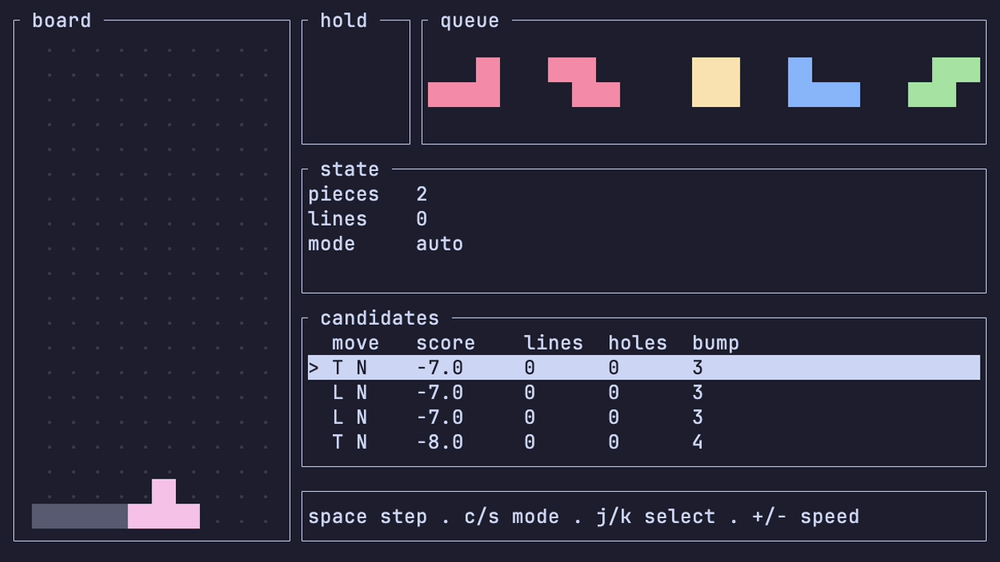

# lion

**Lion** is a both a bot that plays and an engine for modern Tetris.



<sub>Greedy bot playing Tetris via the TUI, debounced at 100ms</sub>

## Benchmarks

Under construction!
<!-- Insert key findings here -->

<!-- You can find a more detailed report [here](BENCHMARKS.md). -->

<!-- Benchmark Entry template -->

## Recording

Right now, I use [VHS](https://github.com/charmbracelet/vhs) to generate GIFs of the bots playing through the TUI, built with [Ratatui](https://ratatui.rs/).

To create recordings via the TUI, see the `viewer.tape` script [here](docs/media/viewer.tape).

## Quickstart

To watch the bot play via the TUI:
```
cargo run -p viewer --release -- --step-mode
```

To simulate games headlessly:
```
cargo run -p arena --release
```

## Status

**Completed**
- Bitboard board representation
- Deterministic 7-bag generation
- SRS engine (kicks, spin detection)
- Greedy heuristic bot with one-piece + hold depth
- Headless arena and TUI viewer
- Statistics library

**In progress**
- CSV session export
- Benchmarks of baseline
- Complete move generation
- Bot lookahead
- Versus mode

## Contributing

Pull requests and suggestions are welcome! Please open an issue to discuss your ideas or report bugs.

## License

[LICENSE](LICENSE)
