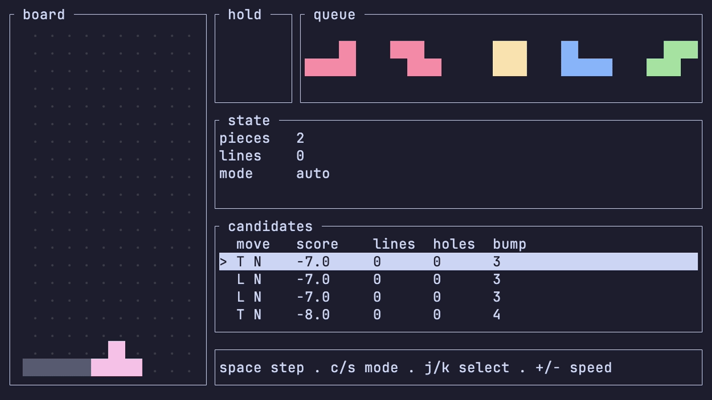

# lion

**Lion** is both a bot that plays and an engine for modern Tetris.



<sub>Greedy bot playing Tetris via the TUI, debounced at 100ms</sub>

## Results

- Greedy bot survives 100k pieces in zen mode (hard-drop, one piece preview + hold piece, hand-picked weights)
- Greedy bot with zero bumpiness weight completes only 6 of 100 games in 40L (same setup as above)
- [Dellacherie bot](https://arxiv.org/pdf/1905.01652) with BFS move generation averages a max height of 4.64 and max at 7.00 across 100 games, median of 102 pieces
- Dellacherie bot with beam search averages a max height of 4.29 and max at 5.00 across 100 games, median of 102 pieces

## Recording

Right now, I use [VHS](https://github.com/charmbracelet/vhs) to generate GIFs of the bots playing through the TUI, built with [Ratatui](https://ratatui.rs/).

To create recordings via the TUI, see the `viewer.tape` script [here](docs/media/viewer.tape).

## Quickstart

To watch the bot play via the TUI:
```
cargo run -p viewer --release -- --step-mode
```

To simulate games headlessly:
```
cargo run -p arena --release
```

To export a session:
```
cargo run -p arena --release -- --label "$(git describe --always --dirty)" --csv path/to/output.csv
```

## Status

**Completed**
- Bitboard board representation
- Deterministic 7-bag generation
- SRS engine (kicks, spin detection)
- Greedy heuristic bot with one-piece + hold depth
- Headless arena and TUI viewer
- Statistics library
- CSV session export
- Benchmarks of baseline
- Complete move generation

**In progress**
- Bot lookahead
- Versus mode

## Contributing

Pull requests and suggestions are welcome! Please open an issue to discuss your ideas or report bugs.

## License

[LICENSE](LICENSE)
